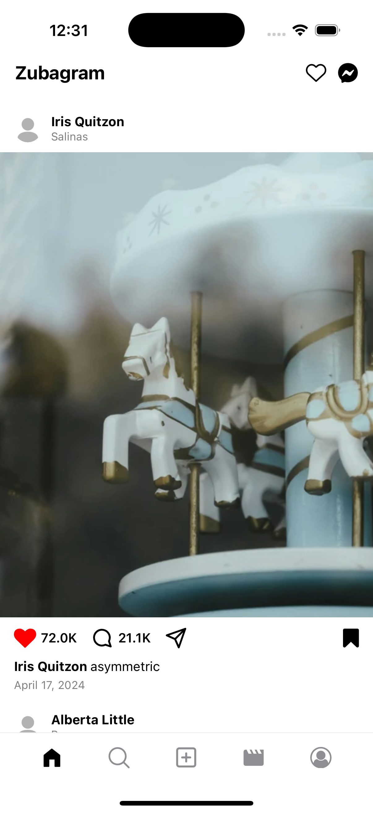

# 📸 Zubale – Mobile Engineer Assessment

This project is a technical implementation for the **Mobile Engineer position at Zubale**, reproducing a simplified Instagram-style feed using **React Native**.

---

## 🧩 Description

The app displays a **dynamic post feed** including images, likes, comments, captions, formatted dates, and animations. It also features advanced UI behavior like scroll-based header visibility, double tap to like, and pull-to-refresh.

---

## 🚀 Tech Stack

- **React Native** (CLI)
- **Axios** – to fetch remote API data
- **Animated API** – for smooth transitions
- **Moment.js** (custom logic) – for Instagram-style date formatting
- **Expo Vector Icons** – for heart, comment, bookmark, and share icons

---

## 📱 Features

### ✅ Post Feed:
- Profile photo (avatar)
- Username
- Post image
- Caption
- Date formatted like Instagram
- Location (if available)

### ✅ Interactions:
- Like button with animation
- Double tap to like
- Save post (bookmark icon)
- Comment and share icons
- Like and comment counters

### ✅ Advanced UX:
- Dynamic header:
  - Hides on scroll down
  - Reappears on scroll up
  - Transparent border at top, visible after scrolling
- Pull-to-refresh support
- Heart animation on like
- Gradient-colored icons (like Instagram)

---

## 🌐 API Used

> **MockAPI:**
> https://662029f13bf790e070af2cd8.mockapi.io/api/v1/posts

The simulated data includes avatar, name, location, post image, likes, comments, and timestamp.

---

## 🧪 How to Run

1. Clone the repository:

```bash
git clone https://github.com/your-username/zubale-instagram-feed.git
cd zubale-instagram-feed
```

2. Install dependencies:

```bash
npm install
```

3. Run on a device or simulator:

```bash
npx react-native run-ios
# or
npx react-native run-android
```

---

## 📁 Project Structure

```
├── App.js
├── api.js
├── FeedScreen.js
├── components/
│   ├── PostCard.js
│   ├── PostHeader.js
│   ├── PostImage.js
│   ├── PostFooter.js
│   ├── PostInteractions.js
│   ├── Header.js
│   ├── BottomBar.js
│   ├── HeartAnimation.js
│   ├── GradientIcon.js
│   ├── ErrorStateImage.js
├── hooks/
│   └── useDoubleTap.js
├── utils/
│   └── formatDate.js
```

---

## 👨‍💻 Author

**Erick Valdiviezo**  
[LinkedIn](https://www.linkedin.com/in/erick-josue-valdiviezo-molina-98b9b8209/) | [GitHub](https://github.com/erickjosue789)

---
# 📸 Project Preview



---

# 🎥 Demo Videos

### ✅ With fallback image (working solution)
[▶ Watch fallback image demo](./assets/project/fallback-image.mp4)

### ❌ When using broken endpoint
[▶ Watch broken endpoint demo](./assets/project/broken-images-endpoint-demo.mp4)

---
> Note: The mock API provided includes image URLs that are no longer accessible.
> To ensure the feed displays correctly, a static fallback image has been used in all posts.

Thank you for your time and consideration 🙌
